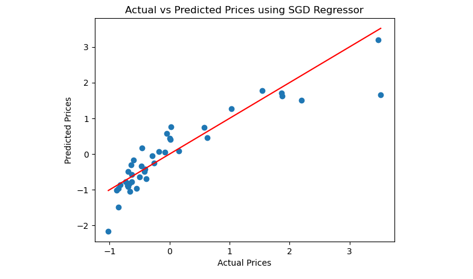

# BLENDED_LEARNING
# Implementation-of-Stochastic-Gradient-Descent-SGD-Regressor

## AIM:
To write a program to implement Stochastic Gradient Descent (SGD) Regressor for linear regression and evaluate its performance.

## Equipments Required:
1. Hardware – PCs
2. Anaconda – Python 3.7 Installation / Jupyter notebook

## Algorithm
1.Import the necessary libraries.
2.Load the dataset.
3.Preprocess the data (handle missing values, encode categorical variables).
4.Split the data into features (X) and target (y).
5.Divide the data into training and testing sets. 6.Create an SGD Regressor model. 7.Fit the model on the training data. 8.Evaluate the model performance. 9.Make predictions and visualize the results.

## Program:
```
/*
Program to implement SGD Regressor for linear regression.
Developed by: SAIGOKUL K
RegisterNumber:  212225240131
*/
```
```
import pandas as pd
import numpy as np
from sklearn.model_selection import train_test_split
from sklearn.linear_model import SGDRegressor
from sklearn.preprocessing import StandardScaler
from sklearn.metrics import mean_squared_error,r2_score,mean_absolute_error
import matplotlib.pyplot as plt
#load the data set
data=pd.read_csv('CarPrice_Assignment.csv')
print(data.head())
print(data.info())
#data preprocessing,dropping the unnecessary coloumn and handling the catergorical variables
data=data.drop(['CarName','car_ID'],axis=1)
data = pd.get_dummies(data, drop_first=True)
#splitting the data 
X=data.drop('price', axis=1)
Y=data['price']
scaler = StandardScaler()
X=scaler.fit_transform(X)
Y=scaler.fit_transform(np.array(Y).reshape(-1, 1))
#splitting the dataset into training and tests
X_train,X_test,Y_train,Y_test=train_test_split(X,Y,test_size=0.2,random_state=42)
#create sdg regressor model
sgd_model= SGDRegressor(max_iter=1000, tol=1e-3)

#fiting the model to training data
sgd_model.fit(X_train, Y_train)
#making predictions
y_pred = sgd_model.predict(X_test)
#evaluating model performance
mse = mean_squared_error(Y_test, y_pred)
r2=r2_score(Y_test,y_pred)
mae= mean_absolute_error(Y_test, y_pred)
#print evaluation metrics
print('Name:SAIGOKUL K')
print('Reg no: 212225240131')
print("Mean Squared Error:",mse)
print("Mean Absolute Error:",mae)
print("R-Squared Score:",r2)

#print model coefficients
print("\nModel Coefficients:")
print("Coefficients:",sgd_model.coef_)
print("Intercept:",sgd_model.intercept_)

#visualising actual vs predicted prices
plt.scatter(Y_test,y_pred)
plt.xlabel("Actual Prices")
plt.ylabel("Predicted Prices")
plt.title("Actual vs Predicted Prices using SGD Regressor")
plt.plot([min(Y_test),max(Y_test)],[min(Y_test),max(Y_test)],color='red')
plt.show()
```

## Output:



## Result:
Thus, the implementation of Stochastic Gradient Descent (SGD) Regressor for linear regression has been successfully demonstrated and verified using Python programming.
